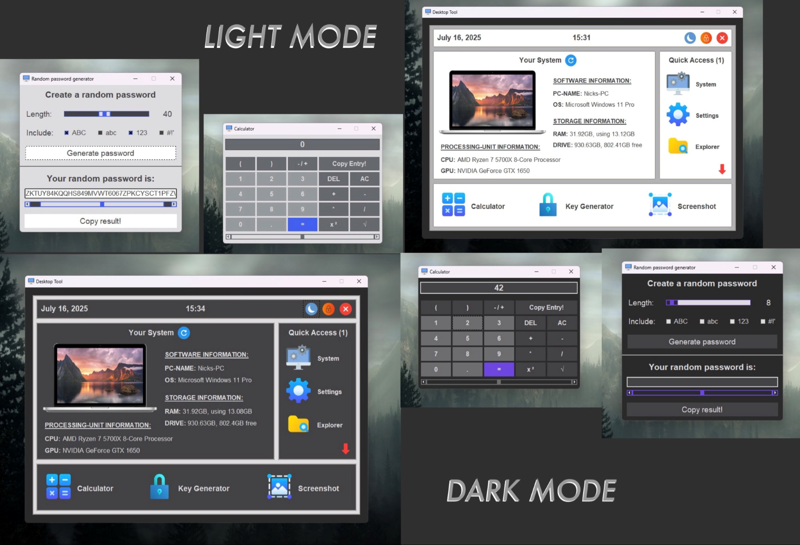

# Windows Desktop Tool (Python & Tkinter)

An Application made with Python and Tkinter

It allows you to:
- View current time and date
- Read out system information
- Access common windows programs
- Launch three built-in applications (e.g. Calculator and password generator)

---

## 🧠 | Concepts used
- Object-oriented design: Each UI frame is a class
- Frame switching mechanism
- Use of `Toplevel` windows for modular sub-apps
- Modular structure with reusable styles and themes

---

## 🛠️ |Technologies & Libraries

- `tkinter` – GUI framework
- `psutil` – System information
- `wmi` – Access Windows system details
- `pyautogui` – Interaction automation
- `Pillow` – Image handling
- `pyperclip` – Clipboard access

---

## 🖼️ | Preview

> ❗ The images in this version (colored rectangles, circles, and laptop) are placeholders due to copyright reasons❗
> The final version would use themed icons and a different laptop image.
> Attribution for the original assets is still included in `graphics/icon-attribution.txt`.
> The following preview shows the original version



---
## 📁 | Project Structure

- `applications/` - Calculator, Password generator, Styles for these apps
- `graphics/` - Icons and UI-Images + Attribution
- `root_ui/` - All UI frames
- `requirements.txt` - Python dependencies
- `main_app.py` - Main window logic
- `main_styles.py` - Styling for main window
- `theme_manager.py` - Appearance mode management
- `start.py` - Initializing file

---

## 🚀 | Installation

1. Clone the repository
```
git clone https://github.com/nickw07/windows-desktoptool-tkinter.git
cd windows-desktoptool-tkinter
```

2. Recommended: Create a virtual environment and activate it *(Example shows activation in CMD)*
```
python -m venv .venv
```
```
.venv\Scripts\activate.bat
```

3. Install required packages
```
pip install -r requirements.txt
```

4. Run the application (`main.py` in `root` folder)
```
python start.py
```

---

## 📒 | Notes

- The application was developed using Python 3.12 and PyCharm
- It is designed specifically for Windows systems due to use of `wmi` and `pyautogui`

---

## 🐛 | Bugs
- Feel free to report any bugs
- ⚠️ There are currently known issues with the calculator top-level window. Problems will be fixed in a future update.